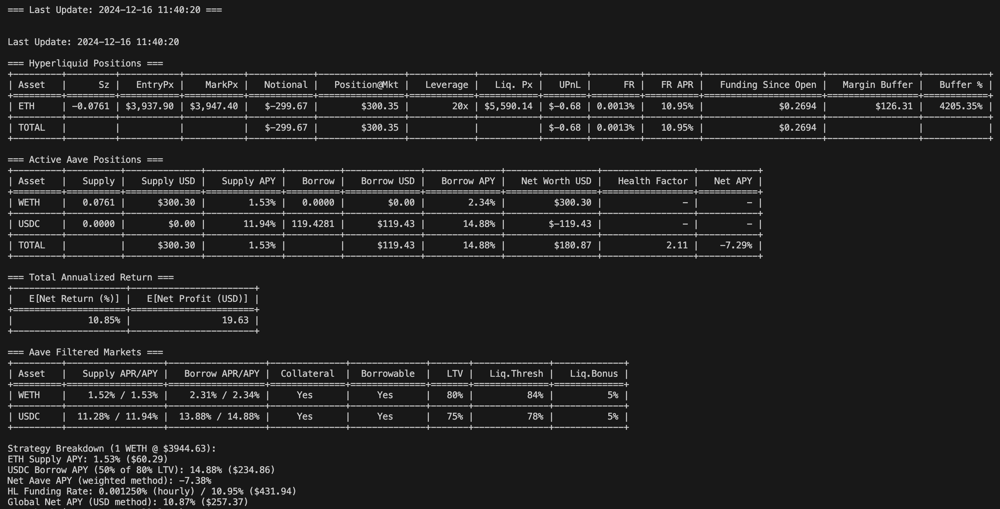

# Delta Neutral Strategy Bot

## Overview
The bot is designed to execute a delta neutral strategy using Aave and Hyperliquid. 

Main steps:
1. Starting from a wallet with an amount of native USDC on Arbitrum
2. Set the config variables in .env file (see .env.example)
3. To make the strategy executable, you need to start with no positions (i.e. no ETH supplied and no USDC borrowed) on Aave
4. Run `main.py`
5. If the MIN_GLOBAL_PROFITABILITY is met, the bot will start borrowing USDC and supplying ETH on Aave, and then open a short on ETH on Hyperliquid
6. The bot will continue to monitor the positions and the expected annualized profitability

Here a screenshot of the bot in action:

## Todo
- better tracking of PnL in terms of fees, delta price pnl, etc.
- automate exit if negative expected annualized return or partial exit if risk of liquidation

## Key Components
- `main.py`: Initializes configurations and starts the bot.
- `exchanges/aave.py` & `exchanges/hyperliquid.py`: Handle interactions with Aave and Hyperliquid.
- `strategies/delta_neutral_executor.py`: delta neutral strategy logic.
- `utils/calculations.py`: functions for calculating APY, costs, etc.
- `utils/monitoring.py`: functions for monitoring on-chain and DEX positions, checking profitability, and risk management, etc.

